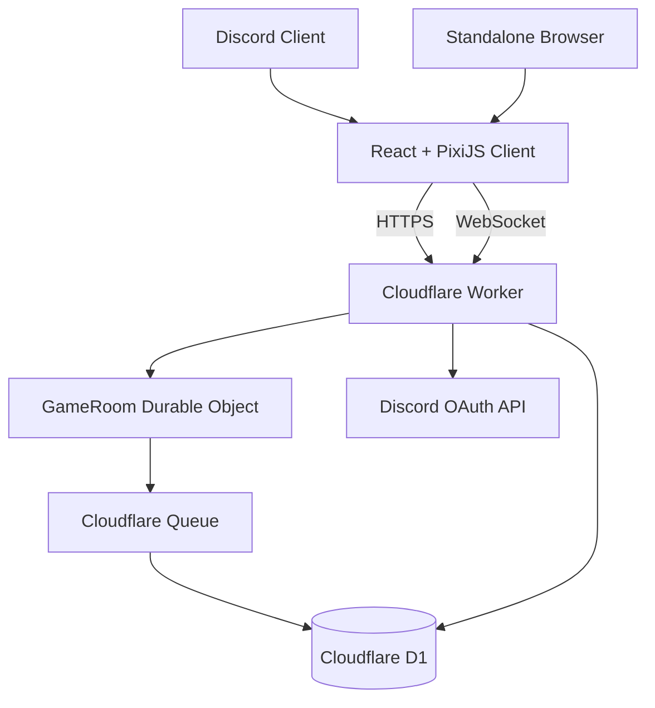

# アーキテクチャ

この文書は、現在のコードベースで採用している構造と、同じ境界上へ追加される製品機能を記述します。未実装のゲーム機能は[ゲーム仕様](GAME_SPEC.md)の製品仕様として扱います。

## 概要

モジュラーモノリスとして構成し、ゲームロジックとクラウド固有処理を分離します。



## コンポーネント

### `packages/game-core`

決定論的な戦闘とルールを保持します。

禁止依存：

- React
- PixiJS
- Discord SDK
- Cloudflare API
- WebSocket
- D1
- `Date.now()`
- `Math.random()`

### `packages/content`

クラス、スキル、敵、ステージ、強化候補などのデータを保持します。表示名とルール上のIDを分離します。

### `packages/protocol`

HTTP／WebSocket／Queue／永続スナップショットの境界スキーマをZodで定義します。型はスキーマから推論します。

### `packages/test-kit`

固定時計、決定論的な試合シナリオ、コマンド再生、通信フィクスチャを提供します。本番コードからは参照せず、テストコードのみが利用します。

### Activity Client

- React：ロビー、選択、設定、リザルト
- PixiJS：戦闘表示とアニメーション
- Platform Bridge：Discordとローカルの差を吸収
- RoomSocket：WebSocket、再接続、プロトコル検証

クライアントは予測表示を行えても、権威状態を書き換えません。

### Edge Worker

- 静的ファイル配信
- Discord OAuthコード交換
- アプリセッション発行
- 短命なルームチケット発行
- Durable Objectへのルーティング
- ヘルスチェック
- 認証・チケット・WebSocket入口のRate Limiting bindingとサイズ制限
- Wrangler生成binding型とZodによる実行時環境検証

### GameRoom Durable Object

- ルームごとの単一権威
- WebSocket接続
- コマンド順序付け
- 固定時間ステップ
- スナップショット
- 再接続
- 切断時AI
- 試合終了イベント送信

### D1

長期データのみを保存します。

- プレイヤー
- 進行
- アンロック
- 試合結果
- 冪等処理済みイベント

座標や敵HPを毎ティック保存しません。

### Queue

試合終了後のD1書き込みを戦闘ループから切り離します。少なくとも一度の配信を前提に、`eventId`で重複を無害化します。

## 依存方向

```text
content ──▶ game-core types

client ──▶ game-core
client ──▶ content
client ──▶ protocol

worker ──▶ game-core
worker ──▶ content
worker ──▶ protocol

test-kit ──▶ game-core
test-kit ──▶ content
test-kit ──▶ protocol
```

`game-core`から外側への依存は禁止します。

## ルーム識別

```text
{environment}:{discordApplicationId}:{instanceId}
```

ローカルではPlatform Bridgeが同等の`roomId`を提供します。外部から受け取ったIDは文字種と長さを検証し、正規化した値だけをDurable Object名に使用します。

## シミュレーション

- 固定ステップ：100ms
- サーバー計算：10Hz
- 状態配信：最大5Hz
- クライアント描画：端末フレームレート
- 乱数：試合シードから生成する決定論的PRNG

クライアントは受信スナップショット間を補間します。

## 認証

### Discord

1. Embedded App SDKで認可コード取得
2. WorkerがDiscord OAuth APIでアクセストークンへ交換
3. Discord SDKの`authenticate`を実行
4. Workerが短命なアプリセッションを発行
5. ルーム接続前に、ルームとユーザーへ限定した短命チケットを発行
6. WebSocketのサブプロトコルでチケットを送信

### ローカル

Local Platform Bridgeが開発ユーザーを作成します。ローカル認証はWorker側でも`APP_ENV=local`と`ALLOW_LOCAL_AUTH=true`を同時に要求します。

## WebSocket

- Hibernation APIで接続を受理
- 添付データに接続ユーザー情報を保存
- 休止復帰時は検証済み添付データからRoom IDを復元
- メッセージは受信直後にスキーマ検証
- `actionId`で再送コマンドを重複排除
- `serverSequence`で順序を明示
- 不整合時は完全スナップショットを再送

## 状態保存

Durable Object Storageへ以下の区切りでチェックポイントを保存します。

- 試合開始
- 参加／退出
- 選択確定
- エリア遷移
- ボス開始
- 一定間隔
- 試合終了

保存データにはスキーマ、ルールセット、コンテンツ、プロトコルのバージョンを含めます。

## 環境分離

- local
- staging
- production

Discord Application、D1、Durable Object namespace、Queue、秘密情報を環境ごとに分離します。本番バインディングをローカルやStagingから参照しません。

Rate Limiting namespaceも環境ごとに分けます。`wrangler.jsonc`をbindingの正本とし、`wrangler types`の生成結果をコミットして、設定とWorker型のずれをCIで拒否します。

## 機械的な境界検査

`.ai/architecture-rules.json`を正本として、`npm run check:architecture`が依存方向、循環依存、禁止import、ゲームコア内の非決定的APIを検査します。文章上の例外ではなく、必要な境界変更を規則ファイルと設計文書へ明示します。
